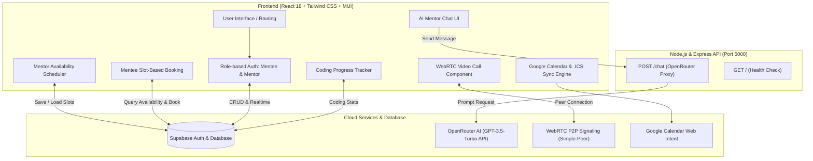
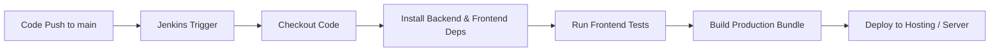

# 🚀 MentorConnect

<div align="center">


### *Empowering Careers Through Structured Mentorship, AI Guidance, and Real-Time Collaboration*

[](https://github.com/ashrafulmohammad555-cloud/connectmentor)
[](https://github.com/ashrafulmohammad555-cloud/connectmentor/pull/2)
[](https://reactjs.org/)
[](https://nodejs.org/)
[](https://expressjs.com/)
[](https://supabase.com/)
[](https://tailwindcss.com/)
[](https://mui.com/)
[](https://webrtc.org/)
[](https://calendar.google.com/)
[](https://openrouter.ai/)
[](https://opensource.org/licenses/ISC)

[Explore Features](#-key-features) • [System Architecture](#-system-architecture) • [Getting Started](#-getting-started) • [Database Schema](#-database-schema) • [API Reference](#-api-endpoints)

---

</div>

## 📌 Overview

**MentorConnect** is a full-stack mentorship and talent accelerator platform connecting aspiring professionals and students (**Mentees**) with experienced industry leaders (**Mentors**).

Beyond simple appointment scheduling, MentorConnect provides an end-to-end growth ecosystem featuring **mentor availability scheduling**, **1-click Google Calendar & .ics synchronization**, **peer-to-peer WebRTC video calling**, **real-time direct messaging**, **24/7 AI mentor assistance**, a **competitive coding progress tracker**, **performance analytics**, and **curated learning resources**.

---

## ✨ Key Features

### 🎓 For Mentees
- 🔍 **Mentor Discovery:** Filter and search mentors across multiple specializations and industry backgrounds.
- 📅 **Slot-Based Booking:** Select dates and view open 30-min/60-min availability slots with automatic conflict detection.
- 📆 **1-Click Google Calendar & .ICS Sync:** Add confirmed sessions to Google Calendar or download standard `.ics` calendar invites for Apple Calendar and Outlook.
- 🤖 **24/7 AI Mentor Assistant:** Interactive AI chatbot powered by Large Language Models (via OpenRouter) to answer coding queries and interview prep questions anytime.
- 📊 **Coding Tracker:** Log and monitor problem-solving milestones (LeetCode metrics: Total Attempted, Solved, Easy/Medium/Hard breakdown).
- 🛣️ **Career Roadmap Generator:** Receive customized career advancement paths tailored to skills and aspirations.
- 💬 **Direct Messaging:** Real-time chat with mentors with edit and delete capabilities.
- 📹 **1-on-1 Video Calling:** Browser-based WebRTC video conferencing with camera/mic stream controls.
- ⭐ **Feedback & Attendance:** Mark session attendance and rate mentors with qualitative reviews and star ratings.

### 💼 For Mentors
- 🧭 **Dedicated Mentor Dashboard:** High-level overview of mentees, upcoming sessions, and received reviews.
- ⏰ **Weekly Availability Scheduler:** Configure recurring weekly time windows (e.g. *Tuesdays & Thursdays 6:00 PM – 8:00 PM*) with custom slot durations.
- 📋 **Booking Request Manager:** Accept or reject incoming mentorship requests with one click.
- 👥 **Mentee Progress Monitoring:** Inspect assigned mentees' LeetCode problem-solving stats and session attendance rates.
- 📈 **Performance Dashboard:** Comprehensive analytics across all mentees to identify students who need support.
- 📚 **Resource Sharing Center:** Publish and manage curated study guides, video tutorials, articles, and roadmaps for mentees.
- 🌟 **Reputation & Review Hub:** Review incoming mentee ratings and feedback to continually refine mentoring sessions.

---

## 🏗️ System Architecture



---

## 🛠️ Technology Stack

| Layer | Technologies |
|---|---|
| **Frontend Framework** | React 18 (Create React App), React Router DOM v6 |
| **Styling & UI** | Tailwind CSS, PostCSS, Material UI (MUI v6), React Icons, FontAwesome |
| **Calendar Synchronization** | Google Calendar Web Intent, RFC-5545 iCalendar (`.ics`) standard |
| **State & Networking** | Axios, Fetch API, Context / Local Storage |
| **Database & Realtime** | Supabase (PostgreSQL, Realtime Subscriptions) |
| **Backend Runtime** | Node.js, Express.js |
| **AI Integration** | OpenRouter API (`openai/gpt-3.5-turbo`) |
| **Media & Communications** | Simple-Peer (WebRTC), React-Webcam |
| **Data Visualization** | Chart.js, React-Chartjs-2 |
| **DevOps & CI/CD** | Jenkins (`Jenkinsfile`), GitHub Actions, Git |

---

## 📂 Directory Structure

```plaintext
connectmentor/
├── backend/                       # Node.js / Express Server
│   ├── package.json              # Server dependencies & scripts
│   ├── package-lock.json
│   └── server.js                 # API endpoints & OpenRouter integration
├── mentorconnect/                 # React Frontend Application
│   ├── public/                   # Static assets and index.html
│   ├── src/
│   │   ├── components/           # Reusable UI components
│   │   │   ├── Features.js       # Landing page features
│   │   │   ├── Footer.js         # Global footer
│   │   │   ├── Header.js         # Navigation header
│   │   │   ├── HeroSection.js    # Hero banner
│   │   │   ├── MenteeNavbar.js   # Mentee-specific navbar
│   │   │   ├── MentorCard.js     # Mentor profile preview card
│   │   │   └── MentorNavbar.js   # Mentor-specific navbar
│   │   ├── pages/                # Application routes and views
│   │   │   ├── AIChatbot.js      # 24/7 AI mentor chat
│   │   │   ├── CodingTracker.js  # LeetCode metrics logger
│   │   │   ├── ExploreMentors.js # Slot-based mentor booking & calendar
│   │   │   ├── FlexibleScheduling.js # Confirmed live sessions & calendar sync
│   │   │   ├── HomePage.js       # Main landing page
│   │   │   ├── LoginPage.js      # Role-based login
│   │   │   ├── ManageMentees.js  # Mentor's mentee roster
│   │   │   ├── MenteeDashboard.js# Mentee overview & stats
│   │   │   ├── MentorAvailability.js # Weekly availability scheduler
│   │   │   ├── MentorDashboard.js# Mentor overview & reviews
│   │   │   ├── Messages.js       # Direct messaging screen
│   │   │   ├── MyBookings.js     # Session history, Google Cal / .ics & reviews
│   │   │   ├── PerformanceDashboard.js # Mentee performance analytics
│   │   │   ├── ResourcesMaterials.js   # Mentor resource publisher
│   │   │   ├── ReviewRequests.js # Booking requests workflow & calendar sync
│   │   │   ├── Roadmap.js        # Career roadmap planner
│   │   │   ├── VideoCall.js      # P2P WebRTC video calling
│   │   │   └── ViewResources.js  # Mentee resource viewer
│   │   ├── utils/
│   │   │   └── calendarSync.js   # Google Calendar & .ics file generator
│   │   ├── supabase.js           # Supabase client configuration
│   │   ├── App.js                # App route definitions
│   │   └── index.js              # Application entry point
│   ├── package.json              # Frontend dependencies & scripts
│   └── tailwind.config.js        # Tailwind CSS styling configuration
├── supabase_availability_schema.sql # Database migration script for availability
├── Jenkinsfile                   # CI/CD automation pipeline
├── .gitignore                    # Git ignore rules
└── README.md                     # Project documentation
```

---

## 🗄️ Database Schema

The application utilizes **Supabase (PostgreSQL)** for persistence. Key tables include:

### 1. `users`
| Column | Type | Description |
|---|---|---|
| `id` | `uuid / int` | Primary key |
| `name` | `text` | Full name of the user |
| `email` | `text` | Unique email identifier |
| `password`| `text` | User authentication credential |
| `role` | `text` | Role: `'mentee'` or `'mentor'` |

### 2. `mentor_availability`
| Column | Type | Description |
|---|---|---|
| `id` | `bigserial` | Primary key |
| `mentor_email` | `text` | Mentor email |
| `day_of_week` | `text` | `'Monday'`, `'Tuesday'`, etc. |
| `start_time` | `text` | Starting time (e.g. `'18:00'`) |
| `end_time` | `text` | Ending time (e.g. `'20:00'`) |
| `slot_duration` | `int` | Duration per slot in minutes (default 30) |
| `is_active` | `boolean` | Slot active status toggle |

### 3. `bookings`
| Column | Type | Description |
|---|---|---|
| `id` | `serial` | Primary key |
| `mentor_email` | `text` | Email of the assigned mentor |
| `mentee_email` | `text` | Email of the mentee |
| `date` | `text / date` | Scheduled session date (`YYYY-MM-DD`) |
| `time` | `text / time` | Scheduled session time |
| `status` | `text` | `'pending'`, `'accepted'`, or `'rejected'` |
| `attended` | `boolean` | Attendance confirmation flag |
| `completed`| `boolean` | Session completion flag |
| `meeting_link` | `text` | Video call or meeting URL |

### 4. `coding_stats`
| Column | Type | Description |
|---|---|---|
| `id` | `serial` | Primary key |
| `user_id` | `uuid / int` | Foreign key referencing `users(id)` |
| `platform` | `text` | Platform name (e.g., `'leetcode'`) |
| `total_attempted` | `int` | Total coding problems attempted |
| `total_solved` | `int` | Total coding problems solved |
| `easy` | `int` | Easy tier problems solved |
| `medium` | `int` | Medium tier problems solved |
| `hard` | `int` | Hard tier problems solved |

### 5. `messages`
| Column | Type | Description |
|---|---|---|
| `id` | `serial` | Primary key |
| `sender_email` | `text` | Sender user email |
| `receiver_email` | `text` | Recipient user email |
| `text` | `text` | Message content |
| `created_at` | `timestamp`| Message creation timestamp |

### 6. `resources`
| Column | Type | Description |
|---|---|---|
| `id` | `serial` | Primary key |
| `mentor_email` | `text` | Author mentor email |
| `title` | `text` | Resource title |
| `description` | `text` | Resource description / overview |
| `link` | `text` | Link to external resource / material |

### 7. `session_feedback`
| Column | Type | Description |
|---|---|---|
| `id` | `serial` | Primary key |
| `booking_id` | `int` | Associated booking ID |
| `mentor_email` | `text` | Mentor receiving feedback |
| `mentee_email` | `text` | Mentee submitting feedback |
| `rating` | `int` | Score from 1 to 5 |
| `comments` | `text` | Feedback comments |
| `suggestions` | `text` | Improvement recommendations |
| `feedback_date`| `date` | Date of submission |

---

## ⚡ Getting Started

### Prerequisites
- [Node.js](https://nodejs.org/) (version 16.x or later)
- [npm](https://www.npmjs.com/) (version 8.x or later)
- A [Supabase](https://supabase.com/) account
- An [OpenRouter](https://openrouter.ai/) API key (for the AI Chatbot)

---

### 1️⃣ Clone the Repository
```bash
git clone https://github.com/ashrafulmohammad555-cloud/connectmentor.git
cd connectmentor
```

---

### 2️⃣ Database Setup (Supabase)
Run the migration script in your Supabase SQL Editor:
- Open [supabase_availability_schema.sql](supabase_availability_schema.sql)
- Paste and execute it in your Supabase Dashboard SQL Editor to set up `mentor_availability` with indexing and RLS.

---

### 3️⃣ Backend Setup
```bash
# Navigate to the backend directory
cd backend

# Install dependencies
npm install

# Create environment configuration
touch .env
```

Add your environment variables to `backend/.env`:
```env
PORT=5000
OPENAI_API_KEY=your_openrouter_api_key_here
```

Start the backend server:
```bash
# Development mode with nodemon
npm run dev

# Or standard production start
npm start
```
> Server runs on `http://localhost:5000`

---

### 4️⃣ Frontend Setup
In a new terminal window:
```bash
# Navigate to the frontend directory
cd mentorconnect

# Install dependencies
npm install

# Start the React development server
npm start
```
> The application will open automatically at `http://localhost:3000`

---

## 🔌 API Endpoints

### Backend (Node.js/Express - `server.js`)
| Method | Endpoint | Description | Payload / Query |
|---|---|---|---|
| `GET` | `/` | Health check endpoint | None (Returns `Backend Running 🚀`) |
| `POST` | `/chat` | AI chatbot completion | `{ "messages": [ { "role": "user", "content": "Hello" } ] }` |

---

## 🚦 CI/CD & Deployment

The repository includes a `Jenkinsfile` for continuous integration and automated builds:



---

## 🤝 Contributing

Contributions are welcome!
1. **Fork** the repository.
2. Create a feature branch:
   ```bash
   git checkout -b feature/AmazingFeature
   ```
3. Commit your changes:
   ```bash
   git commit -m "Add AmazingFeature"
   ```
4. Push to your branch:
   ```bash
   git push origin feature/AmazingFeature
   ```
5. Open a **Pull Request**.

---

## 📄 License

This project is licensed under the [ISC License](https://opensource.org/licenses/ISC).

---

<div align="center">
  <sub>Built with ❤️ by the MentorConnect Team</sub>
</div>
